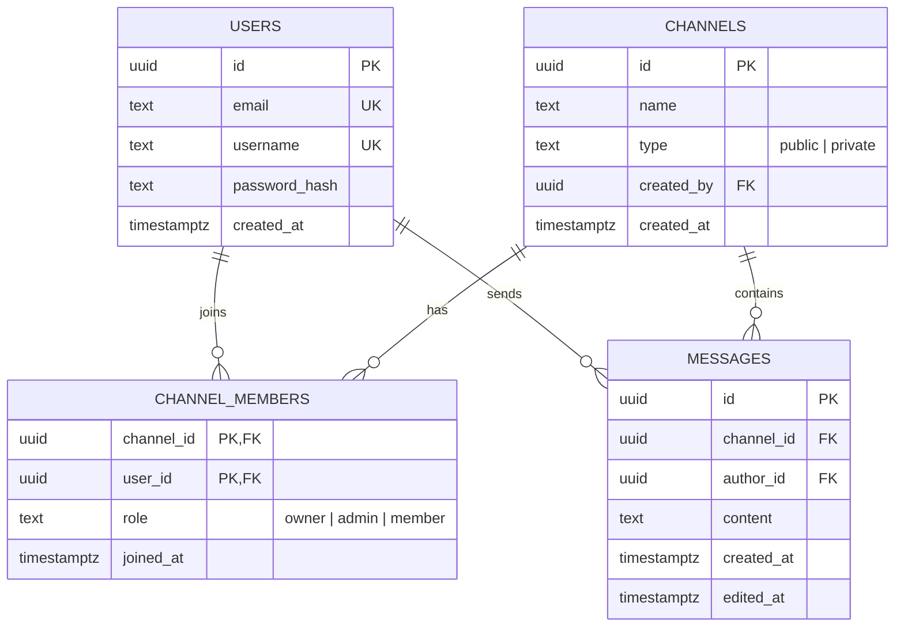

# Database Schema

```mermaid
erDiagram
    USERS ||--o{ CHANNEL_MEMBERS : "joins"
    USERS ||--o{ MESSAGES : "sends"
    CHANNELS ||--o{ CHANNEL_MEMBERS : "has"
    CHANNELS ||--o{ MESSAGES : "contains"

    USERS {
        uuid id PK
        text email UK
        text username UK
        text password_hash
        timestamptz created_at
    }

    CHANNELS {
        uuid id PK
        text name
        text type "public | private"
        uuid created_by FK
        timestamptz created_at
    }

    CHANNEL_MEMBERS {
        uuid channel_id PK,FK
        uuid user_id PK,FK
        text role "owner | admin | member"
        timestamptz joined_at
    }

    MESSAGES {
        uuid id PK
        uuid channel_id FK
        uuid author_id FK
        text content
        timestamptz created_at
        timestamptz edited_at
    }
```